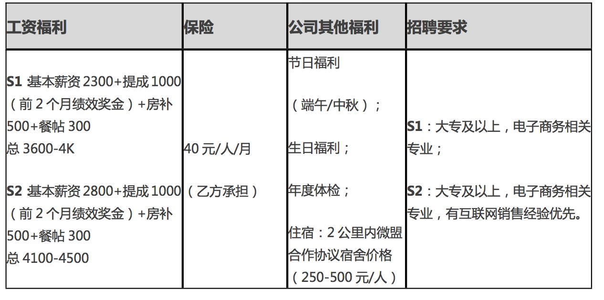

## 上海微盟（合肥）
企业性质：私企

>公司简介：上海微盟企业发展有限公司(简称“微盟”)成立于 2013 年 4 月，总部现有员工 2500 人，全球代理商超过 1300 家，入驻商户突破 220 万家，公司估值近 30 亿美元。经过 4 年 高速发展，微盟已由最初的微信开发服务商，快速发展成为一家专注于移动社交领域的互联 网多元化企业-微盟集团。基于移动社交的核心价值，微盟以跨界领域的软件开发，广告营 销，电商，金融，投资和大数据，形成战略整合，打造微盟移动社交生态圈。
微盟移动社交生态圈，提出三大引擎战略，“软件+营销+平台”。以市场导向提供商 业化服务工具，以效果导向提供精准化营销策略，以数据导向提炼标签化用户行为。
合肥呼叫中心是微盟总部业务模式的升级，将传统的销售模式精细化，配合全国分子公 司业绩提升，目前团队 220 人，年底预计突破 1000 人，办公面积四层楼 6000 平米，营销 产品以微信小程序，微信公众号搭建与代运营服务等为主，旨在打造微盟华东地区最大的呼 叫中心!
我们的使命—— 助力中小企业向智能商业转型升级! 我们的愿景 —— 让商业更智慧!

#### 电话销售(实习生)

#### 工作职责：

* 1.以电话方式发掘追踪潜在客户，积累客户资源；

* 2.分析客户需求，总结市场，行情特征及规律， 为客户提供微信营销方案;

* 3.每月按照既定的任务要求完成商机寻找，转出 意向客户名单;

* 4.促进线下直销团队订单签订;

#### 任职要求:

* 1、大专以上学历;(个人能力优秀者可放宽) 

* 2、具有销售实习经验者优先 

* 3、性格开朗、工作热情积极、踏实肯干; 

* 4、具备良好的沟通说服能力，逻辑清晰; 

* 5、具备良好的抗压能力及团队协作能力; 

* 6、热爱营销类工作，敢于挑战，有志于成为微信营销专家 

* 7、熟练使用 Office 办公软件。

#### 薪资福利:

* 职业前景:业内领先的新媒体营销公司，专注于移动互联网应用研发与新媒体运营推广。 合肥呼叫中心预计年底扩充人员 1000 人以上，机遇与挑战并存! 

* 生活补贴:提供住宿、餐补等各种我们还在想方设法的员工补助，只为你能食宿无忧! 

* 福利待遇:入职就上社会保险(养老、医疗、工伤、失业、生育)!

* 团队氛围:在职 90 后员工占比高达 95%，简单有爱、氛围轻松，追求自由，无障碍的沟 通方式!

* 团建活动:在职公司团建费用 

* 发展平台:互联网营销是每年爆炸式增长的朝阳行业;微盟已正式启动上市流程;公司估 值近 30 亿美元!

* 办公环境:花园式办公环境，超过 6000 平米独立办公区! 

* 园区配套:地铁直达班车，园区内餐厅，便利店方便办公生活! 

* 培训体系:入职即享受十天带薪培训，专业培训+领导力培训! 

* 节日福利:生日会、妇女节，端午节，中秋节，春节都有惊喜等着你! 

* 奖励机制:优秀员工，优秀团队，superstar，内部推荐奖千元现金，多样化的内部奖励 让你王者荣耀!
 

#### 工作环境：

