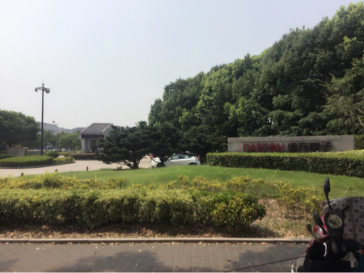
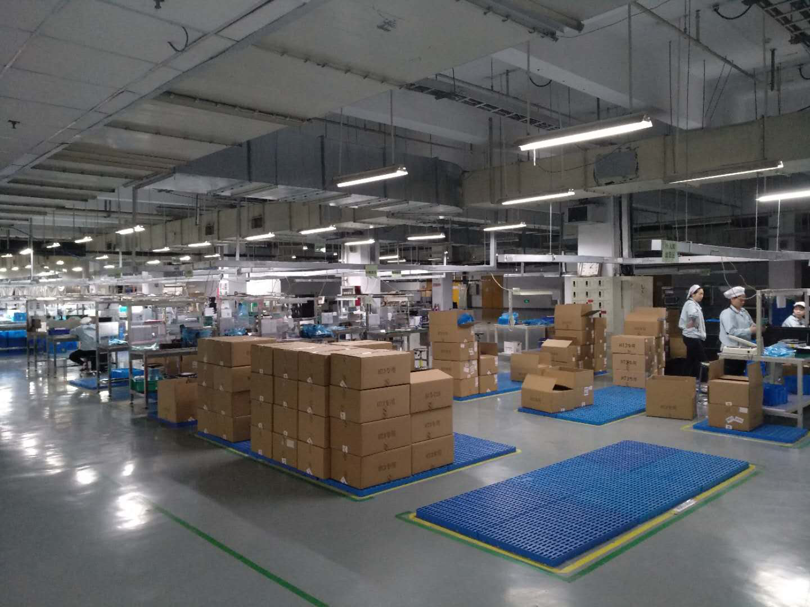
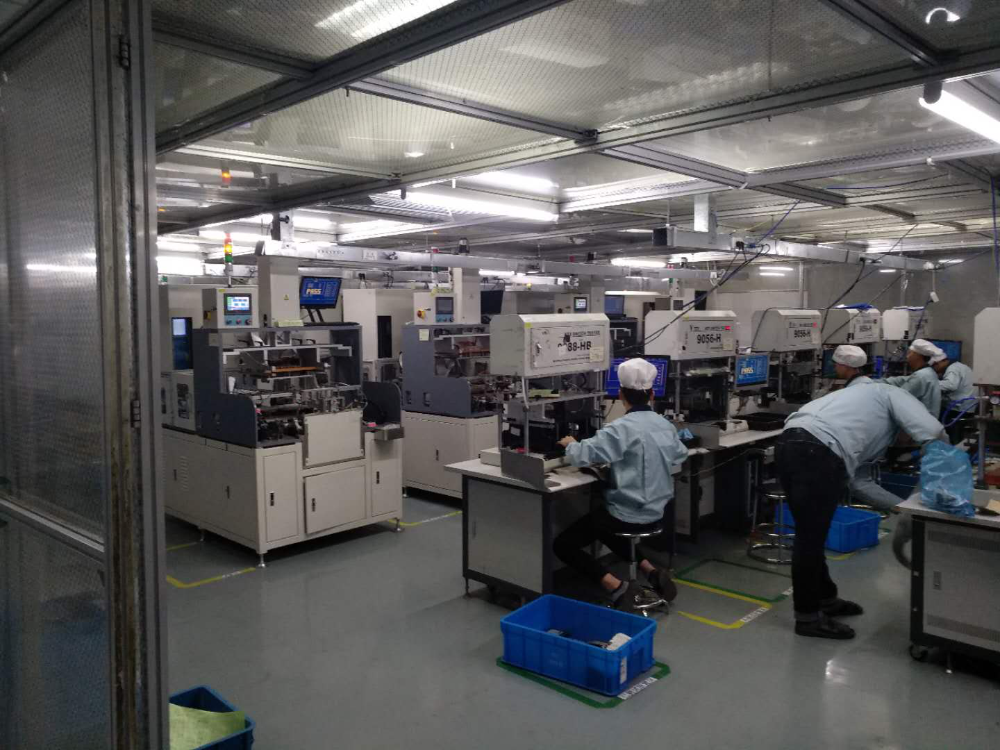
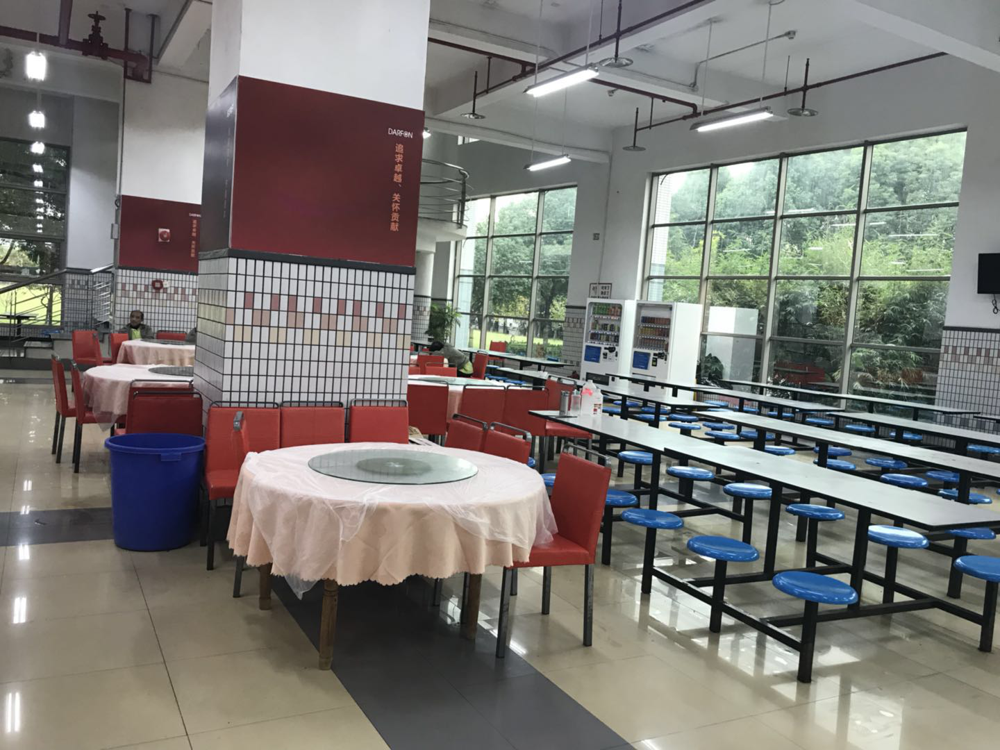
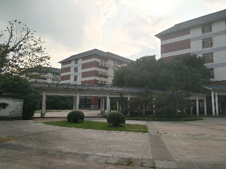

苏州达方电子有限公司
企业性质：台湾独资

>公司简介：苏州达方电子有限公司是台湾明基集团子公司，成立于1999年5月，投资总额4700万美金。公司现位于占地400亩地的达方科技园内。
现阶段公司主要产品为键盘（KEYBOARD），鼠标（MOUSE），表面粘着型变压器（SMD），电压变换器（INVERTER），压控震荡器（VCO）和陶瓷积层电容（MLCC）。我公司系国际化企业，为员工提供机会，体会多国文化交流，丰富人生事业。平时务本，追求卓越，关怀社会是公司的企业文化，力求在工作生活中做到达善臻美，方寸之间。
目前公司员工已达10000多人。公司地址：苏州新区竹园路99号。

#### 招聘要求：

* 1、岗位要求：中专，技校，职校同等学历

* 2、专业要求：电子，机电，数控、机械、计算机等专业优先

* 3、年龄要求：16-35周岁,要身份证原件\复印件

* 4、其他要求：身高适中，身体健康，头脑灵活，吃苦耐劳，无染发、无纹身。

* 5、备注要求：矫正视力300度以下，可配合公司加班。

 

#### 薪资待遇：  3700-4500元/月

* 1、基本薪资：2020元/月 （加班按2020元计算、全勤奖80元）

* 2、夜班津贴：8元/月(160元/月) 

* 3、依岗位不同，约40%的员工可获50-100元岗位津贴

* 4、工作满3个月增加工龄工资100元/月，满半年增至150元/月，满1年增至200元/月  

* 5、加班费用:  以1940元做基数按劳动法执行。
    上六休一，12小时班、8小时以外属于加班。

* 6、提供二顿免费工作餐
    上下班厂车接送（车程10-15分钟）
    免费借阅图书

* 7．住达方宿舍基地：
    住宿松园公寓60元/月住宿费（水电外算），8人间，有独立阳台、独立卫生间、独立冲凉间、有空调、电话、柜子、话吧、,周边配套设施齐全，网吧、歌厅、溜冰场、餐厅等一应齐全.生活非常方便.

 

#### 工作环境：

* 恒温, 从事流水线组装、功能检测、目检、仪器操控等工作。

#### 晋升渠道：

* 公司为员工提供公平,公正之晋升机会，依员工自身的个人特质，可逐渐向管理 职（线长、领班等）、技术职（技术员等）发展,可获最高1000元的职务津贴。

#### 保险保障：

* 为所有员工购买意外保险，为正式员工缴纳养老保险，医疗保险，生育保险，失业保险及工伤保险。

#### 报到须知：

* 1，学校提供资质复印件；

* 2，报到提供合作协议（我司提前安排）；

* 3，学生准备身份证原件及复印件4张；

* 4，准备1寸照片6张；

* 5，生活费若干；
